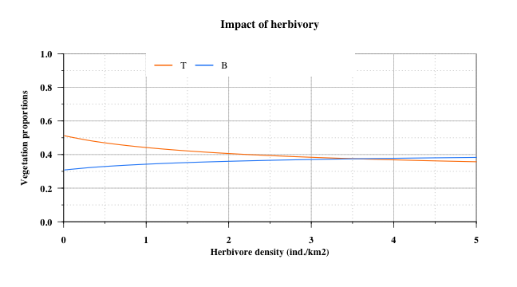
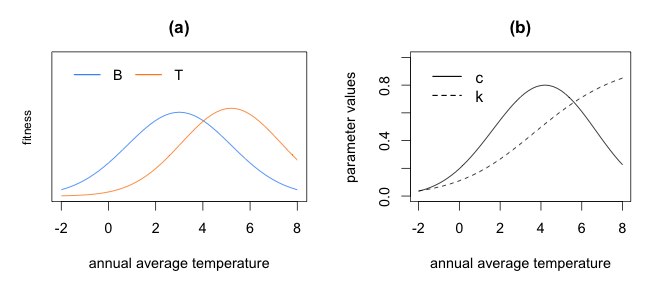

<!-- # ---
# title: "Parmeterization"
# author: "Isabelle Boulangeat"
# date: "02/05/2018"
# output:
#   html_document:
#       keep_md: yes
#       theme: cosmo
#       highlight: tango
#       number_sections: true
#       toc: true
# --- -->

<!-- library(rmarkdown) -->
<!-- library(knitr) -->
<!-- knit("Calibration.Rmd", "Calibration.md") -->

# Consumption

## Load parameters


```r
source("params.r")
params = init.params
```

## Initialisation


```r
T = 0.2
B = 0.5
R = 0.3
```

## test 1 -- reglage de nu / tau
Isle Royale, pour une production de 33000kg/km2 (deciduous leaves, été), et 5 individus/km2, il y a une consommation été de 2000kg/km2 -> 5\%


```r
H= 4.3*358 # biomass per km2
#production totale par km2
(production = (params["uR"]*R + params["uT"]*T))
```

```
##    uR 
## 22000
```

```r
Fs = (params["uR"]*R + params["uT"]*T)*params["f"]
Is = (params["taus"]*Fs/H) / ( params["nus"] + Fs/H)
Us = Is*H
(conso = Us)
```

```
##     taus 
## 1404.395
```

```r
conso/production
```

```
##       taus 
## 0.06383612
```

<!-- ----------------------------------- -->
# Impact

## Load parameters and model


```r
source("params.r")
source("model_fct.r")
params = init.params
source("plot_fct.r")
```

## Libraries


```r
library(rootSolve)
```

## Initialisation


```r
H=5*375
T0 = c(T=.2, R = .2, B = .2)
out = runsteady(func = modelV, y =T0, parms = c(params,H=H), maxsteps = 10000)
(eq = out$y)
```

```
##         T         R         B 
## 0.5505932 0.1101193 0.3303590
```

## Impact function


```r
H = 10
S = seq(0,1, length.out = 100)
G = seq(0,1, length.out = 100)
R1 = S/H
R2 = G/H
alpha = 1
u1 = 200
u2 = 500
h1 = 1/7
h2 = 1/5
r = 5
phi = 0.2
p = 4

I1 = (alpha*u1*R1)/(1 + alpha*h1*u1*R1)

S = 0.5
uS = 2000000
H = seq(0.5,15,by=.1)*37500
R1 = uS*S/H
h1 = 1/12
I1 = (alpha*R1)/(1 + alpha*h1*R1)

pressure = c(0,(I1*H)/(uS*S),1)
h = 0.5
impact =  1/(1+exp(5*(pressure-h)))
``#
```

```
## Error: tentative d'utilisation de nom de variable de longueur nulle
```

```
## Error in eval(predvars, data, env): objet 'impact' introuvable
```

```
## Error in int_abline(a = a, b = b, h = h, v = v, untf = untf, ...): objet 'h' introuvable
```

```
## Error in int_abline(a = a, b = b, h = h, v = v, untf = untf, ...): plot.new has not been called yet
```

```
## Error in text(h + 0.05, 1, "h", cex = 0.8): objet 'h' introuvable
```

```
## Error in eval(predvars, data, env): objet 'impact' introuvable
```

```
## Error in axis(1, at = seq(0.5, 15, l = 6) * 37500, labels = seq(0.5, 15, : plot.new has not been called yet
```

## Impact multiplicative factor


```r
impact <- function(H, eq){

R = eq["R"]
T = eq["T"]
B= eq["B"]
production = (params["uR"]*R + params["uT"]*T)
Fs = (params["uR"]*R + params["uT"]*T)*params["f"]
Is = (params["taus"]*Fs/H) / (params["nus"] + Fs/H)
Us = Is*H

Fw = (params["uT"]*T*(1-params["f"]) + params["uB"]*B)
Iw = (params["tauw"]*Fw/H) / (params["nuw"] + Fw/H)
Uw = Iw*H
chouilla = 0.0001
wt = (eq["T"]+chouilla) / (eq["B"]+eq["T"]+2*chouilla)
wb = (eq["B"]+chouilla) / (eq["B"]+eq["T"]+2*chouilla)
Ot = params["omega"]*wt / (params["omega"]*wt + (1-params["omega"])*wb)
Ob = (1-params["omega"])*wb / (params["omega"]*wt + (1-params["omega"])*wb)

UsS = Us * params["uR"]*eq["R"] / (params["uR"]*eq["R"] + params["uT"]*eq["T"]*params["f"])

PT = UsS*Ot/(params["uR"]*eq["R"]*wt)
PB = UsS*Ob/(params["uR"]*eq["R"]*wb)
PS = UsS/(params["uR"]*eq["R"])


aT = params["a0"]/(1+exp(params["r"]*(PT-params["ptresh"])))
aB = params["a0"]/(1+exp(params["r"]*(PB-params["ptresh"])))
c.par = params["c0"]/(1+exp(params["r"]*(PS-params["ptresh"])))

out = runsteady(func = modelH1, y =T0, parms = c(params,H=H), maxsteps = 10000)
(eq = out$y)

return(list(aT=aT, aB=aB, c=c.par, T = eq["T"], B = eq["B"]))
}
```

varying H per km2


```r
Hseq = seq(0.01,5,le=100)*375
T0 = c(T=.2, R = .2, B = .2)
imp = matrix(NA, dimnames= list(1:100, c("T", "c", "B", "H", "aT", "aB")), nrow = 100, ncol=6)

for ( i in 1:100)
{
res = impact(Hseq[i], eq)
imp[i,"aT"] = res$aT
imp[i,"aB"] = res$aB
imp[i,"c"] = res$c
imp[i,"B"] = res$B
imp[i,"T"] = res$T
imp[i,"H"] = Hseq[i]
}
```




<!-- ----------------------------------- -->
# Coupled modelG

## single way interaction


```r
T0 = c(T = 0.2, R = 0.3, B = 0.4, H=5*375)
out = runsteady(func = modelH, y =T0[4], parms = c(params,T = as.numeric(T0["T"]), R =as.numeric(T0["R"]), B=as.numeric(T0["B"])), maxsteps = 10000)
out$y/360
```

```
##        H 
## 7.661867
```

```r
out = runsteady(func = modelV, y =T0[1:3], parms = c(params,H=as.numeric(T0["H"])), maxsteps = 10000)
out$y
```

```
##         T         R         B 
## 0.5505937 0.1101192 0.3303585
```

## coupled interaction


```r
out = solveEq(func = model, init =T0, parms = params, maxsteps = 10000)
```

```
## Error in solveEq(func = model, init = T0, parms = params, maxsteps = 10000): impossible de trouver la fonction "solveEq"
```

```r
(eq = out$eq)
```

```
## NULL
```

```r
plotEq(out)
```

```
## Error in xy.coords(x, y, xlabel, ylabel, log): 'x' and 'y' lengths differ
```

```r
out = solveEq(func = model, init =eq, parms = params, maxsteps = 10000)
```

```
## Error in solveEq(func = model, init = eq, parms = params, maxsteps = 10000): impossible de trouver la fonction "solveEq"
```

```r
plotEq(out)
```

```
## Error in xy.coords(x, y, xlabel, ylabel, log): 'x' and 'y' lengths differ
```

```r
out$eq["H"]/350
```

```
## numeric(0)
```

## test multiple stable states


```r
Hseq = seq(0.01, 5, l =100)*375
T0 = c(T=.2, R = .2, B = .2)
vegEq = matrix(NA, dimnames= list(1:100, c("T", "R", "B", "H", "V")), nrow = 100, ncol=5)

for ( i in 1:100)
{
out = runsteady(func = modelV, y =T0, parms = c(params,H=Hseq[i]), maxsteps = 10000)
(eq = out$y)
vegEq[i,] = c(eq, Hseq[i], 1 - eq["R"] - eq["T"] - eq["B"])
}
```

<!-- ------------------- -->

# Climate gradient


```r
source("params.r")
```




