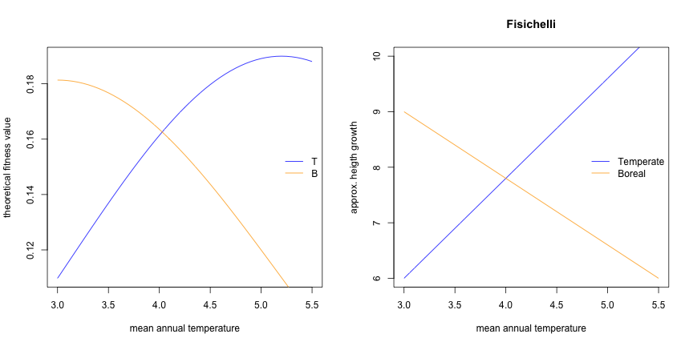

<!-- # --- -->
<!-- # title: "Main analysis" -->
<!-- # author: "Isabelle Boulangeat" -->
<!-- # date: "02/05/2018" -->
<!-- # output:  -->
<!-- #   html_document: -->
<!-- #       keep_md: yes -->
<!-- #       theme: cosmo -->
<!-- #       highlight: tango -->
<!-- #       number_sections: true -->
<!-- #       toc: true -->
<!-- # --- -->

<!-- library(rmarkdown) -->
<!-- library(knitr) -->
<!-- knit("Fisichelli.Rmd", "Fisichelli.md") -->


# Load parameters


```r
source("params.r")
```


# Comparison 


```r
xx = seq(-2,8,len = grad.div)
fit= list()
fit[["T"]] = dnorm(xx, 5.2,2.1)
fit[["B"]] = dnorm(xx, 3,2.2)
fit[["S"]] = apply(cbind(fit[["B"]],fit[["T"]]), 1, function(x){(1*x[2]+1*x[1])})
yy = seq(3,5.5,len = grad.div)
fitT = dnorm(yy, 5.2,2.1)
fitB = dnorm(yy, 3,2.2)
```




