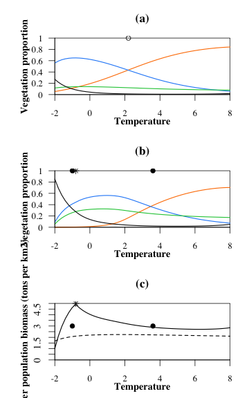
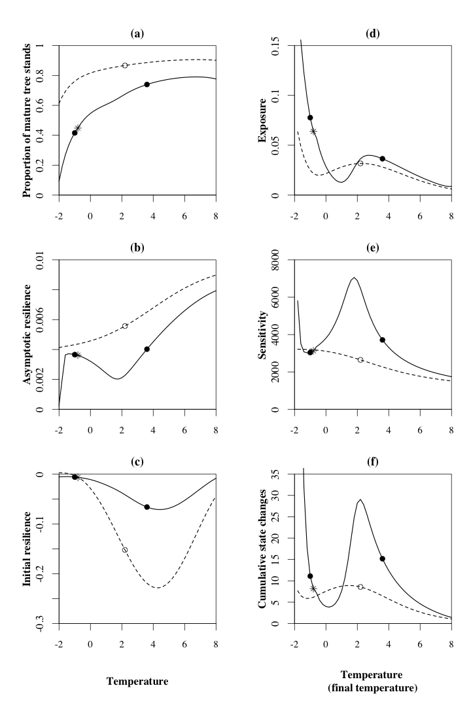
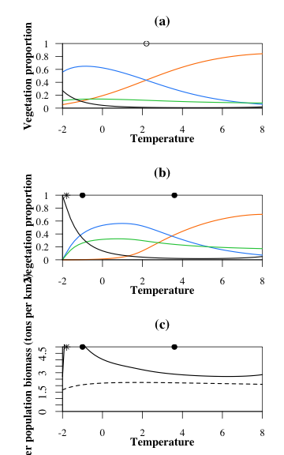
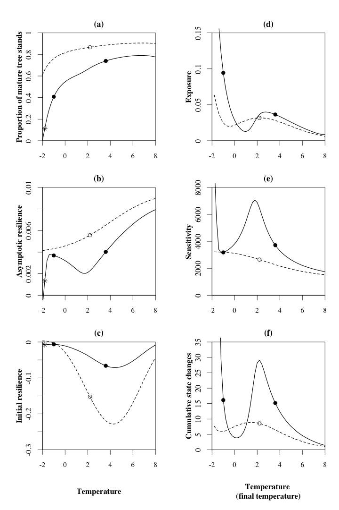

<!-- # --- -->
<!-- # title: "Main analysis" -->
<!-- # author: "Isabelle Boulangeat" -->
<!-- # date: "02/05/2018" -->
<!-- # output:  -->
<!-- #   html_document: -->
<!-- #       keep_md: yes -->
<!-- #       theme: cosmo -->
<!-- #       highlight: tango -->
<!-- #       number_sections: true -->
<!-- #       toc: true -->
<!-- # --- -->

<!-- library(rmarkdown) -->
<!-- library(knitr) -->
<!-- knit("MixedFeeder.Rmd", "MixedFeeder.md") -->


# Variation for a mix-feeder animal


## Load parameters and model

Also load plot functions

```r
rm(list=ls())
source("params.r")
source("model_fct.r")
source("plots_article.r")
source("analysis_fct.r")
```

## Libraries


```r
library(rootSolve)
library(cluster)
```


## Test of the model


```r
T0 = c(T=0.3, R=0.3, B = 0.3, H=5*375)
require(rootSolve)
out = solveEq(func = modelG, init =T0, parms = init.params, maxsteps = 10000)
(eq = out$eq)
```

```
##            T            R            B            H 
##    0.3256289    0.2507971    0.3974442 2960.1702251
```

## Equilibrium along the gradient

Vegetation alone


```r
calcEq.veg = data.frame(t(eqveg.fct.Vect(1:grad.div, init.params, par.name, par.clim)))
newEq.veg = data.frame(matrix(unlist(calcEq.veg[[1]]), ncol = 4, byrow = T))
colnames(newEq.veg) = c("T", "R", "B", "H")
newEq.veg[,"V"] = 1 - newEq.veg[,"R"] - newEq.veg[,"B"] - newEq.veg[,"T"]
lambdamax.veg = unlist(calcEq.veg[[2]])
reac.veg = unlist(calcEq.veg[[3]])
newEq.veg.h0 = newEq.veg
newEq.veg.h0[,"H"] = 0
newEq.veg.For = newEq.veg[,"T"] + newEq.veg[,"B"]
```

Vegetation and herbivore


```r
calcEq.all = data.frame(t(eqall.fct.Vect(1:grad.div, init.params, par.name, par.clim, modelG)))
newEq.all = data.frame(matrix(unlist(calcEq.all[[1]]), ncol = 4, byrow = T))
colnames(newEq.all) = c("T", "R", "B", "H")
newEq.all[,"V"] = 1 - newEq.all[,"R"] - newEq.all[,"B"] - newEq.all[,"T"]
lambdamax.all = unlist(calcEq.all[[3]])
reac.all = unlist(calcEq.all[[4]])
newEq.all.For = newEq.all[,"T"] + newEq.all[,"B"]

Smax = which.max(newEq.all[,"R"])
Bmax = which.max(newEq.all[,"B"])
Hmax = which.max(newEq.all[,"H"])
open = newEq.all[,"V"]
dominance = c("T","B", "V")[apply(cbind(newEq.all[,c("T","B")],open), 1, which.max)]
open.veg = newEq.veg[,"V"]
dominance.veg = c("T","B", "V")[apply(cbind(newEq.veg[,c("T","B")],open.veg), 1, which.max)]
O2B = which(dominance=="B") [1]
B2T = which(dominance=="T") [1]
O2B.veg = which(dominance.veg=="B") [1]
B2T.veg = which(dominance.veg=="T") [1]
```




## Transient metrics


```r
deltaN.all = deltaN.veg =  rep(NA, 50)
dd2<-daisy(newEq.all[,-4], metric="euclidean")
dd.veg2 <- daisy(newEq.veg[,-4], metric="euclidean")
for (g in 1:50)
{
deltaN.all[g] = as.matrix(dd2)[g,g+1]
deltaN.veg[g] = as.matrix(dd.veg2)[g,g+1]
}

simu.time = 10000 # max time of simu before reach eq

calcTime.all = calcTime.Vect(1:50, newEq.all, simu.time=10000, woH=FALSE,init.params=init.params, model=modelG)
deltaT.all = unlist(calcTime.all[1,])
integraleV.all = unlist(calcTime.all[2,]) 

calcTime.veg = calcTime.Vect(1:50, newEq.veg, simu.time=10000, woH=TRUE, init.params=init.params, model=modelG)
deltaT.veg = unlist(calcTime.veg[1,])
integraleV.veg = unlist(calcTime.veg[2,]) 
```




## pG=100


```r
rm(newEq.all, calcTime.all)
init.params["pG"] = 100
calcEq.all = data.frame(t(eqall.fct.Vect(1:grad.div, init.params, par.name, par.clim, modelG)))
newEq.all = data.frame(matrix(unlist(calcEq.all[[1]]), ncol = 4, byrow = T))
colnames(newEq.all) = c("T", "R", "B", "H")
newEq.all[,"V"] = 1 - newEq.all[,"R"] - newEq.all[,"B"] - newEq.all[,"T"]
lambdamax.all = unlist(calcEq.all[[3]])
reac.all = unlist(calcEq.all[[4]])
newEq.all.For = newEq.all[,"T"] + newEq.all[,"B"]

Smax = which.max(newEq.all[,"R"])
Bmax = which.max(newEq.all[,"B"])
Hmax = which.max(newEq.all[,"H"])
open = newEq.all[,"V"]
dominance = c("T","B", "V")[apply(cbind(newEq.all[,c("T","B")],open), 1, which.max)]
open.veg = newEq.veg[,"V"]
dominance.veg = c("T","B", "V")[apply(cbind(newEq.veg[,c("T","B")],open.veg), 1, which.max)]
O2B = which(dominance=="B") [1]
B2T = which(dominance=="T") [1]
O2B.veg = which(dominance.veg=="B") [1]
B2T.veg = which(dominance.veg=="T") [1]
```





```r
deltaN.all =  rep(NA, 50)
dd2<-daisy(newEq.all[,-4], metric="euclidean")
dd.veg2 <- daisy(newEq.veg[,-4], metric="euclidean")
for (g in 1:50)
{
deltaN.all[g] = as.matrix(dd2)[g,g+1]
}

simu.time = 10000 # max time of simu before reach eq

calcTime.all = calcTime.Vect(1:50, newEq.all, simu.time=10000, woH=FALSE,init.params=init.params, model=modelG)
deltaT.all = unlist(calcTime.all[1,])
integraleV.all = unlist(calcTime.all[2,]) 
```




