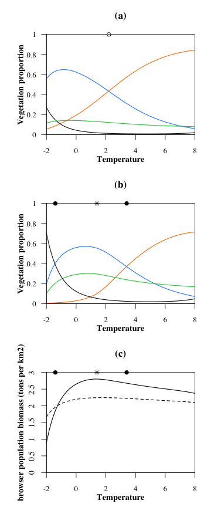

<!-- library(rmarkdown) -->
<!-- library(knitr) -->
<!-- knit("MainAnalysis.Rmd", "Readme.md") -->

# Set up

## Load parameters and model

Also load plot functions

```r
source("params.r")
source("model_fct.r")
source("plot_fct.r")
source("analysis_fct.r")
```

## Libraries


```r
library(rootSolve)
library(cluster)
```

## Test model


```r
T0 = c(T=0.3, S=0.3, B = 0.3, H=5*375)
out = solveEq(func = model, init =T0, parms = init.params, maxsteps = 10000)
```

```
## Error in eval(substitute(expr), data, enclos = parent.frame()): objet 'R' introuvable
```

```r
(eq = out$eq)
```

```
##            T            S            B            H 
##    0.3284338    0.2533228    0.4013544 2779.4831384
```
#  Equilibrium along environmental gradient

## Vegetation alone


```r
calcEq.veg = data.frame(t(eqveg.fct.Vect(1:grad.div, init.params, par.name, par.clim)))
```

```
## Error in if (min(equi.veg > 0)) {: l'argument n'est pas interprétable comme une valeur logique
```

```r
newEq.veg = data.frame(matrix(unlist(calcEq.veg[[1]]), ncol = 4, byrow = T))
colnames(newEq.veg) = c("T", "S", "B", "H")
newEq.veg[,"G"] = 1 - newEq.veg[,"S"] - newEq.veg[,"B"] - newEq.veg[,"T"]
lambdamax.veg = unlist(calcEq.veg[[2]])
reac.veg = unlist(calcEq.veg[[3]])
newEq.veg.h0 = newEq.veg
newEq.veg.h0[,"H"] = 0
newEq.veg.For = newEq.veg[,"T"] + newEq.veg[,"B"]
```

## Vegetation and herbivores


```r
calcEq.all = data.frame(t(eqall.fct.Vect(1:grad.div, init.params, par.name, par.clim, model)))
```

```
## Error in eval(substitute(expr), data, enclos = parent.frame()): objet 'R' introuvable
```

```r
newEq.all = data.frame(matrix(unlist(calcEq.all[[1]]), ncol = 4, byrow = T))
colnames(newEq.all) = c("T", "S", "B", "H")
newEq.all[,"G"] = 1 - newEq.all[,"S"] - newEq.all[,"B"] - newEq.all[,"T"]
oscillations = data.frame(matrix(unlist(calcEq.all[[2]]), nrow = grad.div, byrow = TRUE))
colnames(oscillations) = c("T", "S", "B", "H")
lambdamax.all = unlist(calcEq.all[[3]])
reac.all = unlist(calcEq.all[[4]])
newEq.all.For = newEq.all[,"T"] + newEq.all[,"B"]
```

##  dominance zones


```r
Smax = which.max(newEq.all[,"S"])
Bmax = which.max(newEq.all[,"B"])
Hmax = which.max(newEq.all[,"H"])
open = newEq.all[,"G"]
dominance = c("T","B", "O")[apply(cbind(newEq.all[,c("T","B")],open), 1, which.max)]
open.veg = newEq.veg[,"G"]
dominance.veg = c("T","B", "O")[apply(cbind(newEq.veg[,c("T","B")],open.veg), 1, which.max)]
O2B = which(dominance=="B") [1]
B2T = which(dominance=="T") [1]
O2B.veg = which(dominance.veg=="B") [1]
B2T.veg = which(dominance.veg=="T") [1]
```

## Equilibrium along the environmental gradient: figure




# Transition metrics

##  deltaN


```r
deltaN.all = deltaN.veg =  rep(NA, 50)
require(cluster)
dd2<-daisy(newEq.all[,-4], metric="euclidean")
dd.veg2 <- daisy(newEq.veg[,-4], metric="euclidean")
for (g in 1:50)
{
deltaN.all[g] = as.matrix(dd2)[g,g+1]
deltaN.veg[g] = as.matrix(dd.veg2)[g,g+1]
}
```


## Return to equilibrium after climate change


```r
simu.time = 10000 # max time of simu before reach eq

calcTime.all = calcTime.Vect(1:50, newEq.all, simu.time=10000, woH=FALSE,init.params=init.params, model)
```

```
## Error in eval(substitute(expr), data, enclos = parent.frame()): objet 'R' introuvable
```

```r
deltaT.all = unlist(calcTime.all[1,])
integraleV.all = unlist(calcTime.all[2,]) 

calcTime.veg = calcTime.Vect(1:50, newEq.veg, simu.time=10000, woH=TRUE, init.params=init.params, model)
```

```
## Error in eval(substitute(expr), data, enclos = parent.frame()): objet 'R' introuvable
```

```r
deltaT.veg = unlist(calcTime.veg[1,])
integraleV.veg = unlist(calcTime.veg[2,]) 
```

## All metrics of transient dynamics along the gradient: figure


# Correlations between metrics

## Correlations and tests


```r
(cLDt = c(cor(-lambdamax.veg[-1], deltaT.veg, method="spearman"), cor(-lambdamax.all[-1], deltaT.all, method="spearman")) )
```

```
## [1] -1.0000000 -0.9797359
```

```r
cor.test(-lambdamax.veg[-1], deltaT.veg, method="spearman")
```

```
## 
## 	Spearman's rank correlation rho
## 
## data:  -lambdamax.veg[-1] and deltaT.veg
## S = 41650, p-value < 2.2e-16
## alternative hypothesis: true rho is not equal to 0
## sample estimates:
## rho 
##  -1
```

```r
cor.test(-lambdamax.all[-1], deltaT.all,  method="spearman")
```

```
## 
## 	Spearman's rank correlation rho
## 
## data:  -lambdamax.all[-1] and deltaT.all
## S = 41228, p-value < 2.2e-16
## alternative hypothesis: true rho is not equal to 0
## sample estimates:
##        rho 
## -0.9797359
```

```r
(cLR = c(cor(-lambdamax.veg[-1], -reac.veg[-1], method="spearman"), cor(-lambdamax.all[-1], -reac.all[-1], method="spearman")) )
```

```
## [1] -0.5303721 -0.2478271
```

```r
cor.test(-lambdamax.veg[-1], -reac.veg[-1], method="spearman")
```

```
## 
## 	Spearman's rank correlation rho
## 
## data:  -lambdamax.veg[-1] and -reac.veg[-1]
## S = 31870, p-value = 9.527e-05
## alternative hypothesis: true rho is not equal to 0
## sample estimates:
##        rho 
## -0.5303721
```

```r
cor.test(-lambdamax.all[-1], -reac.all[-1], method="spearman")
```

```
## 
## 	Spearman's rank correlation rho
## 
## data:  -lambdamax.all[-1] and -reac.all[-1]
## S = 25986, p-value = 0.08282
## alternative hypothesis: true rho is not equal to 0
## sample estimates:
##        rho 
## -0.2478271
```

```r
(cDnSn = c(cor(deltaN.veg, integraleV.veg, method="spearman"), cor(deltaN.all, integraleV.all, method="spearman")) )
```

```
## [1] 0.8097479 0.7664346
```

```r
cor.test(deltaN.veg, integraleV.veg, method="spearman") 
```

```
## 
## 	Spearman's rank correlation rho
## 
## data:  deltaN.veg and integraleV.veg
## S = 3962, p-value < 2.2e-16
## alternative hypothesis: true rho is not equal to 0
## sample estimates:
##       rho 
## 0.8097479
```

```r
cor.test(deltaN.all, integraleV.all, method="spearman") 
```

```
## 
## 	Spearman's rank correlation rho
## 
## data:  deltaN.all and integraleV.all
## S = 4864, p-value < 2.2e-16
## alternative hypothesis: true rho is not equal to 0
## sample estimates:
##       rho 
## 0.7664346
```

```r
(cDtSn = c(cor(deltaT.veg, integraleV.veg, method="spearman"), cor(deltaT.all, integraleV.all, method="spearman")) )
```

```
## [1] 0.7510684 0.6228571
```

```r
cor.test(deltaT.veg, integraleV.veg, method="spearman") 
```

```
## 
## 	Spearman's rank correlation rho
## 
## data:  deltaT.veg and integraleV.veg
## S = 5184, p-value < 2.2e-16
## alternative hypothesis: true rho is not equal to 0
## sample estimates:
##       rho 
## 0.7510684
```

```r
cor.test(deltaT.all, integraleV.all, method="spearman") 
```

```
## 
## 	Spearman's rank correlation rho
## 
## data:  deltaT.all and integraleV.all
## S = 7854, p-value = 2.42e-06
## alternative hypothesis: true rho is not equal to 0
## sample estimates:
##       rho 
## 0.6228571
```

```r
(cRDt = c(cor(-reac.veg[-1], deltaT.veg, method="spearman"), cor(-reac.all[-1], deltaT.all, method="spearman")) )
```

```
## [1] 0.5303721 0.1242257
```

```r
cor.test(-reac.veg[-1], deltaT.veg, method="spearman")
```

```
## 
## 	Spearman's rank correlation rho
## 
## data:  -reac.veg[-1] and deltaT.veg
## S = 9780, p-value = 9.527e-05
## alternative hypothesis: true rho is not equal to 0
## sample estimates:
##       rho 
## 0.5303721
```

```r
cor.test(-reac.all[-1], deltaT.all, method="spearman") # NS
```

```
## 
## 	Spearman's rank correlation rho
## 
## data:  -reac.all[-1] and deltaT.all
## S = 18238, p-value = 0.3889
## alternative hypothesis: true rho is not equal to 0
## sample estimates:
##       rho 
## 0.1242257
```

```r
(cLSn = c(cor(-lambdamax.veg[-1], integraleV.veg, method="spearman"), cor(-lambdamax.all[-1], integraleV.all, method="spearman")) )
```

```
## [1] -0.7510684 -0.5486194
```

```r
cor.test(-lambdamax.veg[-1], integraleV.veg, method="spearman") 
```

```
## 
## 	Spearman's rank correlation rho
## 
## data:  -lambdamax.veg[-1] and integraleV.veg
## S = 36466, p-value < 2.2e-16
## alternative hypothesis: true rho is not equal to 0
## sample estimates:
##        rho 
## -0.7510684
```

```r
cor.test(-lambdamax.all[-1], integraleV.all, method="spearman")
```

```
## 
## 	Spearman's rank correlation rho
## 
## data:  -lambdamax.all[-1] and integraleV.all
## S = 32250, p-value = 4.958e-05
## alternative hypothesis: true rho is not equal to 0
## sample estimates:
##        rho 
## -0.5486194
```

```r
(cRSn = c(cor(-reac.veg[-1], integraleV.veg, method="spearman"), cor(-reac.all[-1], integraleV.all, method="spearman")) )
```

```
## [1]  0.1469868 -0.2352461
```

```r
cor.test(-reac.veg[-1], integraleV.veg, method="spearman") # NS
```

```
## 
## 	Spearman's rank correlation rho
## 
## data:  -reac.veg[-1] and integraleV.veg
## S = 17764, p-value = 0.3074
## alternative hypothesis: true rho is not equal to 0
## sample estimates:
##       rho 
## 0.1469868
```

```r
cor.test(-reac.all[-1], integraleV.all, method="spearman") # NS
```

```
## 
## 	Spearman's rank correlation rho
## 
## data:  -reac.all[-1] and integraleV.all
## S = 25724, p-value = 0.1001
## alternative hypothesis: true rho is not equal to 0
## sample estimates:
##        rho 
## -0.2352461
```

```r
(cDnDt = c(cor(deltaN.veg, deltaT.veg, method="spearman"), cor(deltaN.all, deltaT.all, method="spearman")) )
```

```
## [1] 0.7050660 0.2893157
```

```r
cor.test(deltaN.veg, deltaT.veg, method="spearman") 
```

```
## 
## 	Spearman's rank correlation rho
## 
## data:  deltaN.veg and deltaT.veg
## S = 6142, p-value = 5.087e-08
## alternative hypothesis: true rho is not equal to 0
## sample estimates:
##      rho 
## 0.705066
```

```r
cor.test(deltaN.all, deltaT.all, method="spearman") 
```

```
## 
## 	Spearman's rank correlation rho
## 
## data:  deltaN.all and deltaT.all
## S = 14800, p-value = 0.04194
## alternative hypothesis: true rho is not equal to 0
## sample estimates:
##       rho 
## 0.2893157
```

```r
(cDnL = c(cor(deltaN.veg, -lambdamax.veg[-1], method="spearman"), cor(deltaN.all, -lambdamax.all[-1], method="spearman")) )
```

```
## [1] -0.7050660 -0.2513806
```

```r
cor.test(deltaN.veg, -lambdamax.veg[-1], method="spearman") 
```

```
## 
## 	Spearman's rank correlation rho
## 
## data:  deltaN.veg and -lambdamax.veg[-1]
## S = 35508, p-value = 5.087e-08
## alternative hypothesis: true rho is not equal to 0
## sample estimates:
##       rho 
## -0.705066
```

```r
cor.test(deltaN.all, -lambdamax.all[-1], method="spearman") 
```

```
## 
## 	Spearman's rank correlation rho
## 
## data:  deltaN.all and -lambdamax.all[-1]
## S = 26060, p-value = 0.0784
## alternative hypothesis: true rho is not equal to 0
## sample estimates:
##        rho 
## -0.2513806
```

```r
(cDnR = c(cor(deltaN.veg, -reac.veg[-1], method="spearman"), cor(deltaN.all, -reac.all[-1], method="spearman")) )
```

```
## [1]  0.01954382 -0.12220888
```

```r
cor.test(deltaN.veg, -reac.veg[-1], method="spearman") # NS
```

```
## 
## 	Spearman's rank correlation rho
## 
## data:  deltaN.veg and -reac.veg[-1]
## S = 20418, p-value = 0.8927
## alternative hypothesis: true rho is not equal to 0
## sample estimates:
##        rho 
## 0.01954382
```

```r
cor.test(deltaN.all, -reac.all[-1], method="spearman") # NS
```

```
## 
## 	Spearman's rank correlation rho
## 
## data:  deltaN.all and -reac.all[-1]
## S = 23370, p-value = 0.3967
## alternative hypothesis: true rho is not equal to 0
## sample estimates:
##        rho 
## -0.1222089
```

## Correlations : figure


# Simulations of trajectories

## Simulation runs

```r
simu1 = simulation(newEq.all, grad.start=15, grad.pars=15+1, 10000, woH=FALSE, init.params =init.params, model)
```

```
## Error in eval(substitute(expr), data, enclos = parent.frame()): objet 'R' introuvable
```

```r
simu1.veg = simulation(newEq.veg, grad.start=15, grad.pars=15+1, 10000, woH=TRUE, init.params =init.params, model)
```

```
## Error in eval(substitute(expr), data, enclos = parent.frame()): objet 'R' introuvable
```

```r
simu2 = simulation(newEq.all, grad.start=35, grad.pars=35+1, 10000, woH=FALSE, init.params =init.params, model)
```

```
## Error in eval(substitute(expr), data, enclos = parent.frame()): objet 'R' introuvable
```

```r
simu2.veg = simulation(newEq.veg, grad.start=35, grad.pars=35+1, 10000, woH=TRUE, init.params =init.params, model)
```

```
## Error in eval(substitute(expr), data, enclos = parent.frame()): objet 'R' introuvable
```

## Trajectories' examples figure


# Variation for a mix-feeder animal

## Test of the model


```r
T0 = c(T=0.3, S=0.3, B = 0.3, H=5*375)
require(rootSolve)
out = solveEq(func = modelG, init =T0, parms = init.params, maxsteps = 10000)
```

```
## Error in eval(substitute(expr), data, enclos = parent.frame()): objet 'R' introuvable
```

```r
(eq = out$eq)
```

```
##            T            S            B            H 
##    0.3284338    0.2533228    0.4013544 2779.4831384
```

## Equilibrium along the gradient


```r
calcEq.all = data.frame(t(eqall.fct.Vect(1:grad.div, init.params, par.name, par.clim, modelG)))
```

```
## Error in eval(substitute(expr), data, enclos = parent.frame()): objet 'R' introuvable
```

```r
newEq.all = data.frame(matrix(unlist(calcEq.all[[1]]), ncol = 4, byrow = T))
colnames(newEq.all) = c("T", "S", "B", "H")
newEq.all[,"G"] = 1 - newEq.all[,"S"] - newEq.all[,"B"] - newEq.all[,"T"]
oscillations = data.frame(matrix(unlist(calcEq.all[[2]]), nrow = grad.div, byrow = TRUE))
colnames(oscillations) = c("T", "S", "B", "H")
lambdamax.all = unlist(calcEq.all[[3]])
reac.all = unlist(calcEq.all[[4]])

Smax = which.max(newEq.all[,"S"])
Bmax = which.max(newEq.all[,"B"])
Hmax = which.max(newEq.all[,"H"])
open = newEq.all[,"G"]
dominance = c("T","B", "O")[apply(cbind(newEq.all[,c("T","B")],open), 1, which.max)]
open.veg = newEq.veg[,"G"]
dominance.veg = c("T","B", "O")[apply(cbind(newEq.veg[,c("T","B")],open.veg), 1, which.max)]
O2B = which(dominance=="B") [1]
B2T = which(dominance=="T") [1]
O2B.veg = which(dominance.veg=="B") [1]
B2T.veg = which(dominance.veg=="T") [1]
```


## Transient metrics


```r
newEq.all.For = newEq.all[,"T"] + newEq.all[,"B"]

deltaN.all =rep(NA, 50)
require(cluster)
dd2<-daisy(newEq.all[,-4], metric="euclidean")
for (g in 1:50)
{
  deltaN.all[g] = as.matrix(dd2)[g,g+1]
}
simu.time = 10000 # max time of simu before reach eq
calcTime.all = calcTime.Vect(1:50, newEq.all, simu.time=10000, woH=FALSE,init.params=init.params, model=modelG)
```

```
## Error in eval(substitute(expr), data, enclos = parent.frame()): objet 'R' introuvable
```

```r
deltaT.all = unlist(calcTime.all[1,])
integraleV.all = unlist(calcTime.all[2,]) 
```


