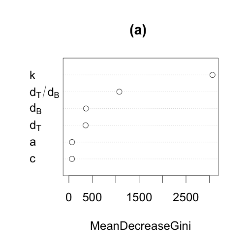
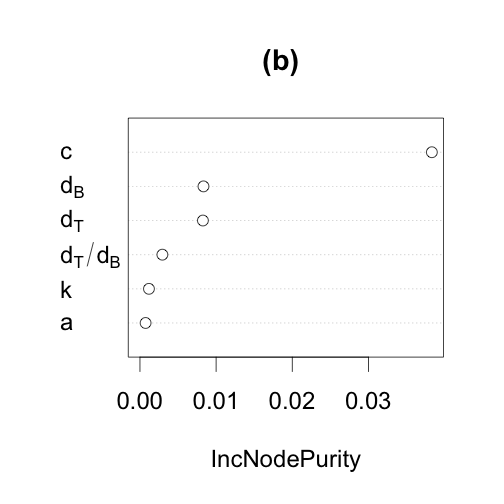

<!-- # ---
# title: "Parmeterization"
# author: "Isabelle Boulangeat"
# date: "02/05/2018"
# output:
#   html_document:
#       keep_md: yes
#       theme: cosmo
#       highlight: tango
#       number_sections: true
#       toc: true
# --- -->

<!-- library(rmarkdown) -->
<!-- library(knitr) -->
<!-- knit("Sensitivity_analysis.Rmd", "Sensitivity_analysis.md") -->

# Load model an params


```r
rm(list=ls())
source("model_fct.r")
source("analysis_fct.r")
source("plots_article.r")
params =  c(
a0 = 0.05,
dT = 0.004,
dB = 0.05,
c0 = 0.5,
k = .6
)
```

# Equilibrium


```r
with(as.list(params),
{
equi_veget(alpha=a0, c = c0, k = k, deltaB = dB, deltaT = dT)
})
```

```
##          T          R          B 
## 0.83202958 0.11093728 0.04437491
```

# Sensivity analysis

## Sampling


```r
library(lhs)
set.seed(999)
lhs = randomLHS(10000,5)
parDesign=data.frame(lhs)
parDesign$a0 <- qnorm(lhs[,1], mean=.05, sd=0.01)
parDesign$c0 <- qnorm(lhs[,2], mean=.5, sd=0.1)
parDesign$dT <- 1/(qnorm(lhs[,3], mean=250, sd=50))
parDesign$dB = 1/(qnorm(lhs[,4], mean=250, sd=50))
parDesign$dTdB  = parDesign$dT/parDesign$dB
parDesign$k <- qnorm(lhs[,5], mean=.5, sd=0.1)

parLHS.pars = parDesign[, which(colnames(parDesign)%in%names(params))]
nrow(parLHS.pars)
```

```
## [1] 10000
```

```r
nrow(unique(parLHS.pars))
```

```
## [1] 10000
```

```r
summary(parLHS.pars)
```

```
##        a0                c0               dT                 dB          
##  Min.   :0.01227   Min.   :0.1281   Min.   :0.002237   Min.   :0.002277  
##  1st Qu.:0.04325   1st Qu.:0.4326   1st Qu.:0.003525   1st Qu.:0.003525  
##  Median :0.05000   Median :0.5000   Median :0.004000   Median :0.004000  
##  Mean   :0.05000   Mean   :0.5000   Mean   :0.004185   Mean   :0.004185  
##  3rd Qu.:0.05674   3rd Qu.:0.5674   3rd Qu.:0.004624   3rd Qu.:0.004624  
##  Max.   :0.09319   Max.   :0.8877   Max.   :0.022337   Max.   :0.023549  
##        k         
##  Min.   :0.1041  
##  1st Qu.:0.4326  
##  Median :0.5000  
##  Mean   :0.5000  
##  3rd Qu.:0.5674  
##  Max.   :0.9182
```

## Runs


```r
eq.veg.SA = matrix(NA, dimnames= list(1:nrow(parLHS.pars), c("T", "S", "B")), ncol =3, nrow = nrow(parLHS.pars) )

for(i in 1:nrow(parLHS.pars))
{
	# if(i%%1000==0) print(i)
res = with(as.list(parLHS.pars[i,]),
{
equi_veget(alpha=a0, c = c0, k = k, deltaB = dB, deltaT = dT)
})
eq.veg.SA[i,] = res
}

head(eq.veg.SA)
```

```
##           T          S         B
## 1 0.2896410 0.08898134 0.6130787
## 2 0.5968630 0.07739720 0.3167007
## 3 0.5273054 0.06136760 0.4048651
## 4 0.2760058 0.09259019 0.6212108
## 5 0.4204781 0.06153730 0.5117971
## 6 0.4605067 0.08751861 0.4417070
```

## Analysis


```r
library(randomForest)
forest = eq.veg.SA[,"T"]+eq.veg.SA[,"B"]
dominance = c("T","B","V")[apply(cbind(eq.veg.SA[,-2], 1-forest),1, which.max)]
table(dominance)
```

```
## dominance
##    B    T 
## 4990 5010
```

```r
mod1 = randomForest(as.factor(dominance)~., data = parDesign[,c("a0","c0","k","dT","dB","dTdB")])
importance(mod1)
```

```
##      MeanDecreaseGini
## a0           66.91222
## c0           66.12709
## k          3065.51376
## dT          366.82341
## dB          357.41886
## dTdB       1076.69667
```

```r
open = 1-apply(eq.veg.SA, 1, sum)
mod2 = randomForest(open~., data = parDesign[,c("a0","c0","k","dT","dB","dTdB")])
importance(mod2)
```

```
##      IncNodePurity
## a0    0.0007396706
## c0    0.0383360092
## k     0.0011803390
## dT    0.0083422626
## dB    0.0082673601
## dTdB  0.0029445471
```

## Graphiques


k is the most important for T/B dominance


c is the most important for open dominance


