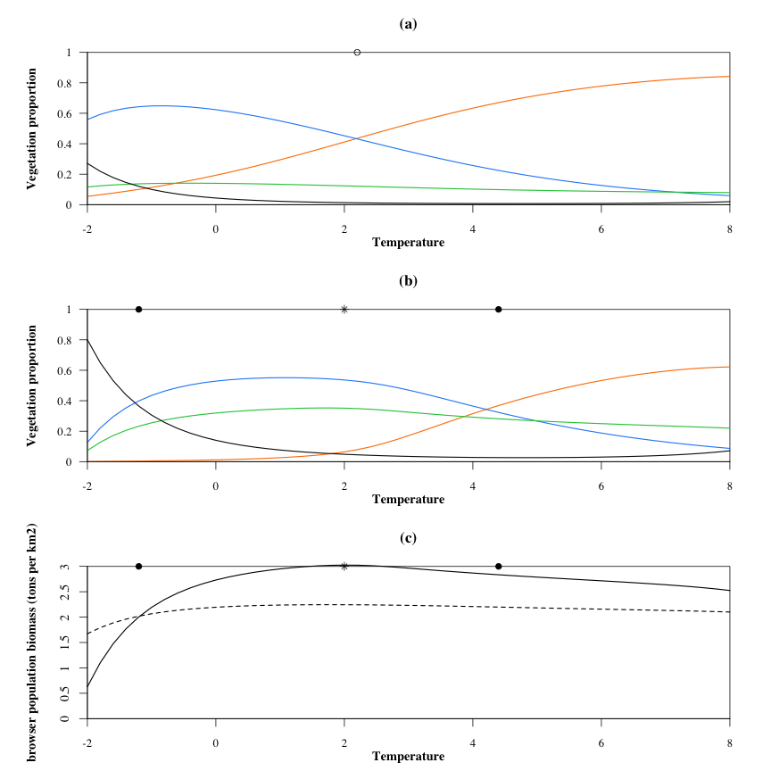
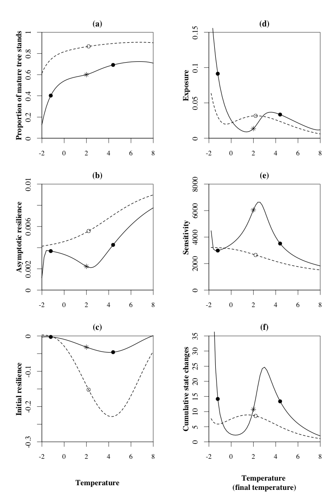
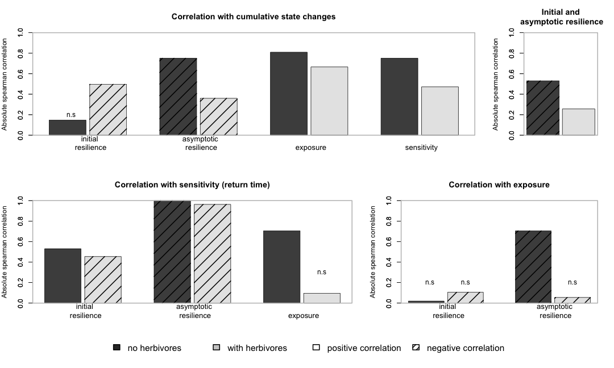

<!-- library(rmarkdown) -->
<!-- library(knitr) -->
<!-- knit("preference_pR.Rmd", "preference_pR.md") -->

# Set up

## Load model and parameters


```r
rm(list=ls())
source("params.r")
source("model_fct.r")
source("plots_article.r")
source("analysis_fct.r")
```

## Libraries


```r
library(rootSolve)
library(cluster)
```

# Change preference parameter


```r
init.params["pR"] = 0.8
```

# Analysis

## Equilibrium along the gradient

### Vegetation alone

```r
calcEq.veg = data.frame(t(eqveg.fct.Vect(1:grad.div, init.params, par.name, par.clim)))
newEq.veg = data.frame(matrix(unlist(calcEq.veg[[1]]), ncol = 4, byrow = T))
colnames(newEq.veg) = c("T", "R", "B", "H")
newEq.veg[,"V"] = 1 - newEq.veg[,"R"] - newEq.veg[,"B"] - newEq.veg[,"T"]
lambdamax.veg = unlist(calcEq.veg[[2]])
reac.veg = unlist(calcEq.veg[[3]])
newEq.veg.h0 = newEq.veg
newEq.veg.h0[,"H"] = 0
newEq.veg.For = newEq.veg[,"T"] + newEq.veg[,"B"]
```

### Vegetation and hrebivores

```r
calcEq.all = data.frame(t(eqall.fct.Vect(1:grad.div, init.params, par.name, par.clim, model)))
newEq.all = data.frame(matrix(unlist(calcEq.all[[1]]), ncol = 4, byrow = T))
colnames(newEq.all) = c("T", "R", "B", "H")
newEq.all[,"V"] = 1 - newEq.all[,"R"] - newEq.all[,"B"] - newEq.all[,"T"]
oscillations = data.frame(matrix(unlist(calcEq.all[[2]]), nrow = grad.div, byrow = TRUE))
colnames(oscillations) = c("T", "R", "B", "H")
lambdamax.all = unlist(calcEq.all[[3]])
reac.all = unlist(calcEq.all[[4]])
newEq.all.For = newEq.all[,"T"] + newEq.all[,"B"]
```

### Domiance

```r
Smax = which.max(newEq.all[,"R"])
Bmax = which.max(newEq.all[,"B"])
Hmax = which.max(newEq.all[,"H"])
open = newEq.all[,"V"]
dominance = c("T","B", "V")[apply(cbind(newEq.all[,c("T","B")],open), 1, which.max)]
open.veg = newEq.veg[,"V"]
dominance.veg = c("T","B", "V")[apply(cbind(newEq.veg[,c("T","B")],open.veg), 1, which.max)]
O2B = which(dominance=="B") [1]
B2T = which(dominance=="T") [1]
O2B.veg = which(dominance.veg=="B") [1]
B2T.veg = which(dominance.veg=="T") [1]
```

### Equilibrium figure



## Transient metrics


```r
deltaN.all = deltaN.veg =  rep(NA, 50)
require(cluster)
dd2<-daisy(newEq.all[,-4], metric="euclidean")
dd.veg2 <- daisy(newEq.veg[,-4], metric="euclidean")
for (g in 1:50)
{
deltaN.all[g] = as.matrix(dd2)[g,g+1]
deltaN.veg[g] = as.matrix(dd.veg2)[g,g+1]
}
simu.time = 10000 # max time of simu before reach eq

calcTime.all = calcTime.Vect(1:50, newEq.all, simu.time=10000, woH=FALSE,init.params=init.params, model)
deltaT.all = unlist(calcTime.all[1,])
integraleV.all = unlist(calcTime.all[2,]) 

calcTime.veg = calcTime.Vect(1:50, newEq.veg, simu.time=10000, woH=TRUE, init.params=init.params, model)
deltaT.veg = unlist(calcTime.veg[1,])
integraleV.veg = unlist(calcTime.veg[2,]) 
```



## Correlations


```r
(cLDt = c(cor(-lambdamax.veg[-1], deltaT.veg, method="spearman"), cor(-lambdamax.all[-1], deltaT.all, method="spearman")) )
```

```
## [1] -1.0000000 -0.9633133
```

```r
cor.test(-lambdamax.veg[-1], deltaT.veg, method="spearman")
```

```
## 
## 	Spearman's rank correlation rho
## 
## data:  -lambdamax.veg[-1] and deltaT.veg
## S = 41650, p-value < 2.2e-16
## alternative hypothesis: true rho is not equal to 0
## sample estimates:
## rho 
##  -1
```

```r
cor.test(-lambdamax.all[-1], deltaT.all,  method="spearman")
```

```
## 
## 	Spearman's rank correlation rho
## 
## data:  -lambdamax.all[-1] and deltaT.all
## S = 40886, p-value < 2.2e-16
## alternative hypothesis: true rho is not equal to 0
## sample estimates:
##        rho 
## -0.9633133
```

```r
(cLR = c(cor(-lambdamax.veg[-1], -reac.veg[-1], method="spearman"), cor(-lambdamax.all[-1], -reac.all[-1], method="spearman")) )
```

```
## [1] -0.5303721  0.2564706
```

```r
cor.test(-lambdamax.veg[-1], -reac.veg[-1], method="spearman")
```

```
## 
## 	Spearman's rank correlation rho
## 
## data:  -lambdamax.veg[-1] and -reac.veg[-1]
## S = 31870, p-value = 9.527e-05
## alternative hypothesis: true rho is not equal to 0
## sample estimates:
##        rho 
## -0.5303721
```

```r
cor.test(-lambdamax.all[-1], -reac.all[-1], method="spearman")
```

```
## 
## 	Spearman's rank correlation rho
## 
## data:  -lambdamax.all[-1] and -reac.all[-1]
## S = 15484, p-value = 0.07239
## alternative hypothesis: true rho is not equal to 0
## sample estimates:
##       rho 
## 0.2564706
```

```r
(cDnSn = c(cor(deltaN.veg, integraleV.veg, method="spearman"), cor(deltaN.all, integraleV.all, method="spearman")) )
```

```
## [1] 0.8097479 0.6663625
```

```r
cor.test(deltaN.veg, integraleV.veg, method="spearman") 
```

```
## 
## 	Spearman's rank correlation rho
## 
## data:  deltaN.veg and integraleV.veg
## S = 3962, p-value < 2.2e-16
## alternative hypothesis: true rho is not equal to 0
## sample estimates:
##       rho 
## 0.8097479
```

```r
cor.test(deltaN.all, integraleV.all, method="spearman") 
```

```
## 
## 	Spearman's rank correlation rho
## 
## data:  deltaN.all and integraleV.all
## S = 6948, p-value = 3.312e-07
## alternative hypothesis: true rho is not equal to 0
## sample estimates:
##       rho 
## 0.6663625
```

```r
(cDtSn = c(cor(deltaT.veg, integraleV.veg, method="spearman"), cor(deltaT.all, integraleV.all, method="spearman")) )
```

```
## [1] 0.7510684 0.4720768
```

```r
cor.test(deltaT.veg, integraleV.veg, method="spearman") 
```

```
## 
## 	Spearman's rank correlation rho
## 
## data:  deltaT.veg and integraleV.veg
## S = 5184, p-value < 2.2e-16
## alternative hypothesis: true rho is not equal to 0
## sample estimates:
##       rho 
## 0.7510684
```

```r
cor.test(deltaT.all, integraleV.all, method="spearman") 
```

```
## 
## 	Spearman's rank correlation rho
## 
## data:  deltaT.all and integraleV.all
## S = 10994, p-value = 0.0006199
## alternative hypothesis: true rho is not equal to 0
## sample estimates:
##       rho 
## 0.4720768
```

```r
(cRDt = c(cor(-reac.veg[-1], deltaT.veg, method="spearman"), cor(-reac.all[-1], deltaT.all, method="spearman")) )
```

```
## [1]  0.5303721 -0.4544058
```

```r
cor.test(-reac.veg[-1], deltaT.veg, method="spearman")
```

```
## 
## 	Spearman's rank correlation rho
## 
## data:  -reac.veg[-1] and deltaT.veg
## S = 9780, p-value = 9.527e-05
## alternative hypothesis: true rho is not equal to 0
## sample estimates:
##       rho 
## 0.5303721
```

```r
cor.test(-reac.all[-1], deltaT.all, method="spearman") 
```

```
## 
## 	Spearman's rank correlation rho
## 
## data:  -reac.all[-1] and deltaT.all
## S = 30288, p-value = 0.001031
## alternative hypothesis: true rho is not equal to 0
## sample estimates:
##        rho 
## -0.4544058
```

```r
(cLSn = c(cor(-lambdamax.veg[-1], integraleV.veg, method="spearman"), cor(-lambdamax.all[-1], integraleV.all, method="spearman")) )
```

```
## [1] -0.7510684 -0.3600960
```

```r
cor.test(-lambdamax.veg[-1], integraleV.veg, method="spearman") 
```

```
## 
## 	Spearman's rank correlation rho
## 
## data:  -lambdamax.veg[-1] and integraleV.veg
## S = 36466, p-value < 2.2e-16
## alternative hypothesis: true rho is not equal to 0
## sample estimates:
##        rho 
## -0.7510684
```

```r
cor.test(-lambdamax.all[-1], integraleV.all, method="spearman") 
```

```
## 
## 	Spearman's rank correlation rho
## 
## data:  -lambdamax.all[-1] and integraleV.all
## S = 28324, p-value = 0.01058
## alternative hypothesis: true rho is not equal to 0
## sample estimates:
##       rho 
## -0.360096
```

```r
(cRSn = c(cor(-reac.veg[-1], integraleV.veg, method="spearman"), cor(-reac.all[-1], integraleV.all, method="spearman")) )
```

```
## [1]  0.1469868 -0.4966627
```

```r
cor.test(-reac.veg[-1], integraleV.veg, method="spearman") # NS
```

```
## 
## 	Spearman's rank correlation rho
## 
## data:  -reac.veg[-1] and integraleV.veg
## S = 17764, p-value = 0.3074
## alternative hypothesis: true rho is not equal to 0
## sample estimates:
##       rho 
## 0.1469868
```

```r
cor.test(-reac.all[-1], integraleV.all, method="spearman") 
```

```
## 
## 	Spearman's rank correlation rho
## 
## data:  -reac.all[-1] and integraleV.all
## S = 31168, p-value = 0.0002922
## alternative hypothesis: true rho is not equal to 0
## sample estimates:
##        rho 
## -0.4966627
```

```r
(cDnDt = c(cor(deltaN.veg, deltaT.veg, method="spearman"), cor(deltaN.all, deltaT.all, method="spearman")) )
```

```
## [1] 0.70506603 0.09560624
```

```r
cor.test(deltaN.veg, deltaT.veg, method="spearman") 
```

```
## 
## 	Spearman's rank correlation rho
## 
## data:  deltaN.veg and deltaT.veg
## S = 6142, p-value = 5.087e-08
## alternative hypothesis: true rho is not equal to 0
## sample estimates:
##      rho 
## 0.705066
```

```r
cor.test(deltaN.all, deltaT.all, method="spearman") # NS
```

```
## 
## 	Spearman's rank correlation rho
## 
## data:  deltaN.all and deltaT.all
## S = 18834, p-value = 0.5078
## alternative hypothesis: true rho is not equal to 0
## sample estimates:
##        rho 
## 0.09560624
```

```r
(cDnL = c(cor(deltaN.veg, -lambdamax.veg[-1], method="spearman"), cor(deltaN.all, -lambdamax.all[-1], method="spearman")) )
```

```
## [1] -0.70506603 -0.05527011
```

```r
cor.test(deltaN.veg, -lambdamax.veg[-1], method="spearman") 
```

```
## 
## 	Spearman's rank correlation rho
## 
## data:  deltaN.veg and -lambdamax.veg[-1]
## S = 35508, p-value = 5.087e-08
## alternative hypothesis: true rho is not equal to 0
## sample estimates:
##       rho 
## -0.705066
```

```r
cor.test(deltaN.all, -lambdamax.all[-1], method="spearman") # NS
```

```
## 
## 	Spearman's rank correlation rho
## 
## data:  deltaN.all and -lambdamax.all[-1]
## S = 21976, p-value = 0.7023
## alternative hypothesis: true rho is not equal to 0
## sample estimates:
##         rho 
## -0.05527011
```

```r
(cDnR = c(cor(deltaN.veg, -reac.veg[-1], method="spearman"), cor(deltaN.all, -reac.all[-1], method="spearman")) )
```

```
## [1]  0.01954382 -0.10578631
```

```r
cor.test(deltaN.veg, -reac.veg[-1], method="spearman") # NS
```

```
## 
## 	Spearman's rank correlation rho
## 
## data:  deltaN.veg and -reac.veg[-1]
## S = 20418, p-value = 0.8927
## alternative hypothesis: true rho is not equal to 0
## sample estimates:
##        rho 
## 0.01954382
```

```r
cor.test(deltaN.all, -reac.all[-1], method="spearman") # NS
```

```
## 
## 	Spearman's rank correlation rho
## 
## data:  deltaN.all and -reac.all[-1]
## S = 23028, p-value = 0.4635
## alternative hypothesis: true rho is not equal to 0
## sample estimates:
##        rho 
## -0.1057863
```


```r
plot_correlations_pR()
```



