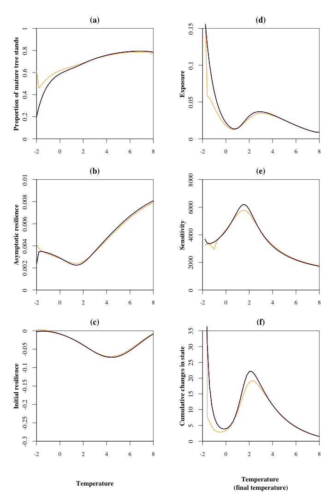

<!-- # --- -->
<!-- # title: "Main analysis" -->
<!-- # author: "Isabelle Boulangeat" -->
<!-- # date: "02/05/2018" -->
<!-- # output:  -->
<!-- #   html_document: -->
<!-- #       keep_md: yes -->
<!-- #       theme: cosmo -->
<!-- #       highlight: tango -->
<!-- #       number_sections: true -->
<!-- #       toc: true -->
<!-- # --- -->

<!-- library(rmarkdown) -->
<!-- library(knitr) -->
<!-- knit("suppGradients.Rmd", "suppGradients.md") -->


# Load parameters and model

Also load plot functions

```r
source("params.r")
source("model_fct.r")
source("plot_fct.r")
source("analysis_fct.r")
```

And libraries

```r
library(rootSolve)
```

# Variation gradient/ parameters


```r
par.name = c("c0", "k")
par.clim = data.frame(c0 = c0.var, k = k.var)
analysis.base = applyAnalysis(model=model, init.params=init.params, grad.div=grad.div, gradient=gradient,par.clim=par.clim, par.name=par.name)
variation = seq(0.1,2,length.out = grad.div)
```

## Vegetation productivity gradient


```r
ufactor = variation
```


## Herbivore energy depense gradient


```r
energyfactor = variation
par.name = c("c0", "k", "es", "ew")
par.clim = data.frame(c0 = c0.var, k = k.var, es=energyfactor*init.params["es"], ew =energyfactor*init.params["ew"])

analysis.energy = applyAnalysis(init.params=init.params, grad.div=grad.div, gradient=gradient,par.clim=par.clim, par.name=par.name, model=model)
```

## Herbivore effect gradient


```r
par.name = c("c0", "k", "ptresh")
herbivoryfactor = variation
par.clim = data.frame(c0 = c0.var, k = k.var, ptresh=herbivoryfactor*init.params["ptresh"])

analysis.herbivory = applyAnalysis(init.params=init.params, grad.div=grad.div, gradient=gradient,par.clim=par.clim, par.name=par.name, model=model)
```

## Season length effect gradient


```r
par.name = c("c0", "k", "gseason")
gfactor = seq(185, 65, length.out = grad.div)
par.clim = data.frame(c0 = c0.var, k = k.var, gseason=gfactor)

analysis.season = applyAnalysis(init.params=init.params, grad.div=grad.div, gradient=gradient,par.clim=par.clim, par.name=par.name, model=model)
```


# Figure




